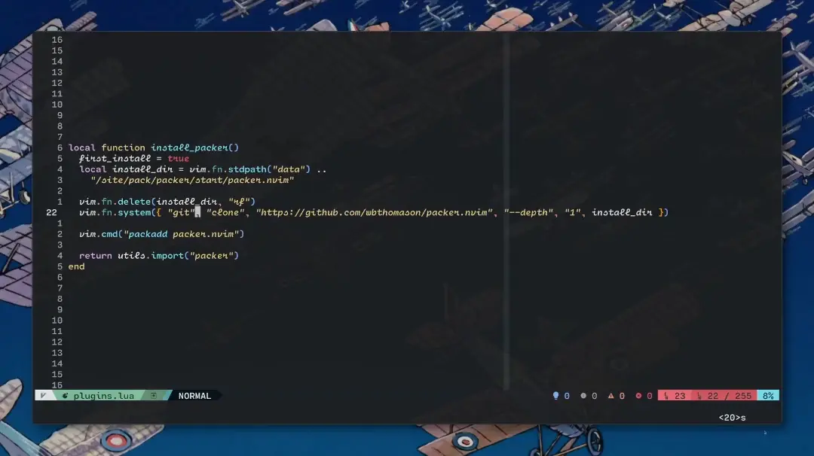

<h1 align="center">spread.nvim</h1>



**WORK IN PROGRESS**

a plugin to refactor and spread out objects, arrays, parameter lists, etc onto
multiple lines

this plugin uses treesitter so be sure to also install
[nvim-treesitter][nvim-treesitter]

## installation

using [packer][packer]:

```lua
use({
	"aarondiel/spread.nvim",
	after = "nvim-treesitter",
	config = function()
		local spread = require("spread")
		local default_options = {
			silent = true,
			noremap = true
		}

		vim.keymap.add("n", "<leader>ss", spread.out, default_options)
		vim.keymap.add("n", "<leader>ssc", spread.combine, default_options)
	end
})
```

[nvim-treesitter]: https://github.com/nvim-treesitter/nvim-treesitter
[packer]: https://github.com/wbthomason/packer.nvim
